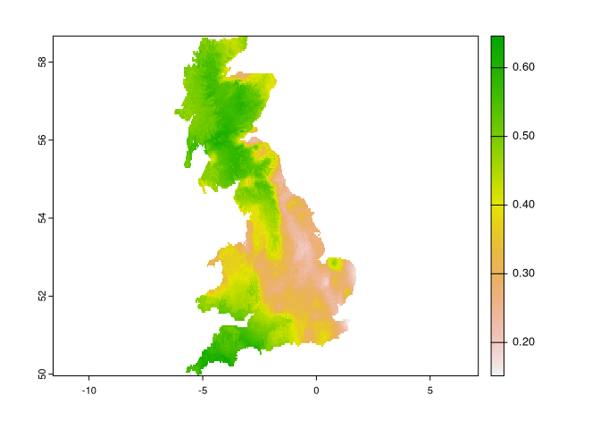

<!-- README.md is generated from README.Rmd. Please edit that file -->

# spquery

<!-- badges: start -->

[](https://lifecycle.r-lib.org/articles/stages.html#experimental)
<!-- badges: end -->

The goal of spquery is to …

## Installation

You can install the development version of spquery from
[GitHub](https://github.com/) with:

``` r
# install.packages("devtools")
devtools::install_github("Nowosad/spquery")
```

## Example

``` r
library(terra)
#> terra 1.5.40
library(sf)
#> Linking to GEOS 3.10.2, GDAL 3.4.3, PROJ 8.2.1; sf_use_s2() is TRUE
library(spquery)
```

``` r
ta = rast(system.file("raster/ta_scaled.tif", package = "spquery"))
plot(ta)
```


``` r
pr = rast(system.file("raster/pr_scaled.tif", package = "spquery"))
plot(pr)
```


### Comparison

``` r
re = spq_compare(ta, pr, dist_fun = "jensen-shannon")
plot(re)
```


