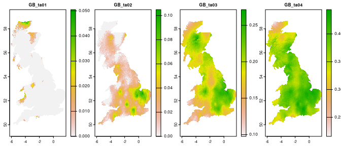

<!-- README.md is generated from README.Rmd. Please edit that file -->

# spquery

<!-- badges: start -->

[](https://github.com/Nowosad/spquery/actions)
[](https://lifecycle.r-lib.org/articles/stages.html#experimental)
<!-- badges: end -->

The **spquery** package allows to perform several queries based on
spatial raster data.

## Installation

You can install the development version of spquery from
[GitHub](https://github.com/) with:

``` r
# install.packages("devtools")
devtools::install_github("Nowosad/spquery")
```

## Example

``` r
library(terra)
#> terra 1.5.41
library(sf)
#> Linking to GEOS 3.10.2, GDAL 3.4.3, PROJ 8.2.1; sf_use_s2() is TRUE
library(spquery)
```

``` r
ta = rast(system.file("raster/ta_scaled.tif", package = "spquery"))[[1:4]]
plot(ta, nr = 1)
```



``` r
pr = rast(system.file("raster/pr_scaled.tif", package = "spquery"))[[1:4]]
plot(pr, nr = 1)
```


### Comparison

``` r
re = spq_compare(ta, pr, dist_fun = "jensen-shannon")
plot(re)
```


## Contribution

Contributions to this package are welcome - let us know if you need
other distance measures or transformations, have any suggestions, or
spotted a bug. The preferred method of contribution is through a GitHub
pull request. Feel also free to contact us by creating [an
issue](https://github.com/nowosad/spquery/issues).
