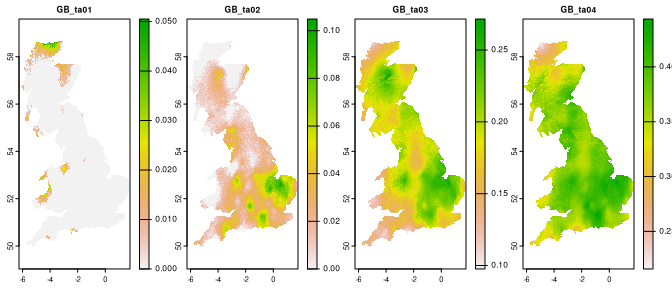
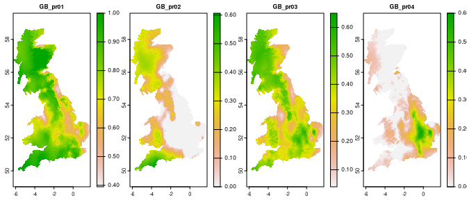
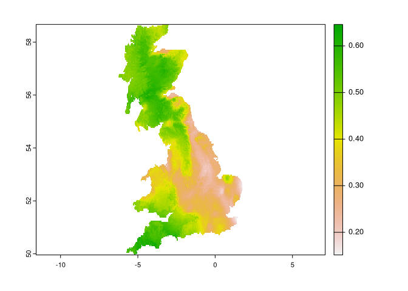

# spquery

The **spquery** package performs several queries based on spatial raster
data.

## Installation

You can install the development version of spquery from
[GitHub](https://github.com/) with:

``` r

# install.packages("devtools")
devtools::install_github("Nowosad/spquery")
```

## Example

``` r

library(terra)
#> terra 1.5.41
library(sf)
#> Linking to GEOS 3.10.2, GDAL 3.4.3, PROJ 8.2.1; sf_use_s2() is TRUE
library(spquery)
```

``` r

ta = rast(system.file("raster/ta_scaled.tif", package = "spquery"))[[1:4]]
plot(ta, nr = 1)
```



``` r

pr = rast(system.file("raster/pr_scaled.tif", package = "spquery"))[[1:4]]
plot(pr, nr = 1)
```



### Comparison

``` r

re = spq_compare(ta, pr, dist_fun = "jensen-shannon")
plot(re)
```



## Contribution

Contributions to this package are welcome - let us know if you need
other distance measures or transformations, have any suggestions, or
spotted a bug. The preferred method of contribution is through a GitHub
pull request. Feel also free to contact us by creating [an
issue](https://github.com/nowosad/spquery/issues).
